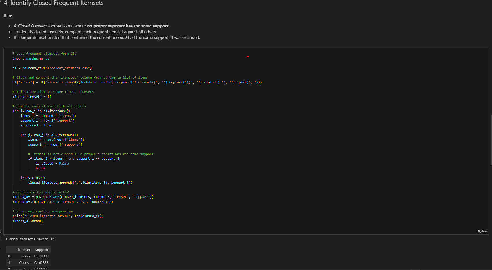

# Frequent Itemsets Analysis

This project simulates supermarket transaction data, preprocesses it, and analyzes frequent itemsets using the Apriori algorithm. It identifies frequent, closed, and maximal itemsets and saves results to CSV files.

## Project Structure

- `frequent_itemsets_analysis.ipynb` — Main Jupyter notebook containing all code and analysis steps.
- `supermarket_transactions.csv` — Simulated transaction data.
- `frequent_itemsets.csv` — Top 10 frequent itemsets.
- `closed_itemsets.csv` — Closed frequent itemsets.
- `maximal_itemsets.csv` — Maximal frequent itemsets.

## Workflow Overview

1. **Simulate Transaction Data**
    - Generates 3000 transactions, each with 2–7 random items from a predefined pool.
    - Saves transactions to `supermarket_transactions.csv`.

 

2. **Preprocessing: One-Hot Encoding**
    - Extracts all unique items.
    - Converts transactions to a one-hot encoded DataFrame (each column is an item, each row a transaction).

     

3. **Generate Frequent Itemsets**
    - Uses `mlxtend.frequent_patterns.apriori()` with `min_support=0.05`.
    - Sorts and exports the top 10 itemsets to `frequent_itemsets.csv`.

 

4. **Identify Closed Frequent Itemsets**
    - Loads frequent itemsets from CSV.
    - Finds itemsets where no proper superset has the same support.
    - Saves closed itemsets to `closed_itemsets.csv`.

 

5. **Identify Maximal Frequent Itemsets**
    - Loads frequent itemsets from CSV.
    - Finds itemsets where no frequent superset exists.
    - Saves maximal itemsets to `maximal_itemsets.csv`.

     

## How to Run

1. **Install Requirements**
    - Python 3.x
    - Jupyter Notebook
    - pandas
    - mlxtend

    ```sh
    pip install pandas mlxtend notebook
    ```

2. **Open and Run Notebook**
    - Open `frequent_itemsets_analysis.ipynb` in Jupyter Notebook or VS Code.
    - Run all cells sequentially.

3. **Outputs**
    - Check the generated CSV files for results.

## Key Files

- [`frequent_itemsets_analysis.ipynb`](frequent_itemsets_analysis.ipynb): Main analysis notebook.
- [`supermarket_transactions.csv`](supermarket_transactions.csv): Simulated transactions.
- [`frequent_itemsets.csv`](frequent_itemsets.csv): Top frequent itemsets.
- [`closed_itemsets.csv`](closed_itemsets.csv): Closed itemsets.
- [`maximal_itemsets.csv`](maximal_itemsets.csv): Maximal itemsets.

## Authors

- Marilyn: Data simulation and saving transactions.
- Chad: Preprocessing and one-hot encoding.
- Hetal: Frequent itemset mining.
- Rita: Closed and maximal itemset identification.


